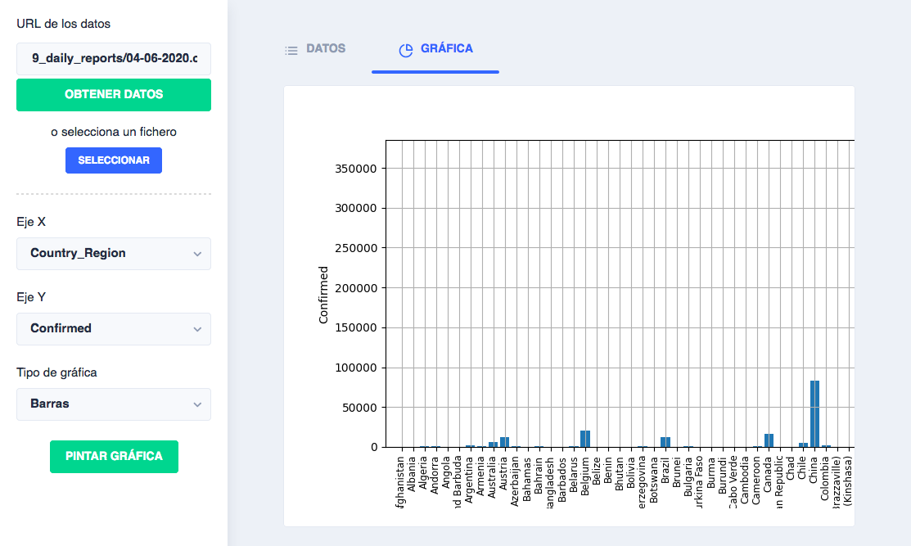
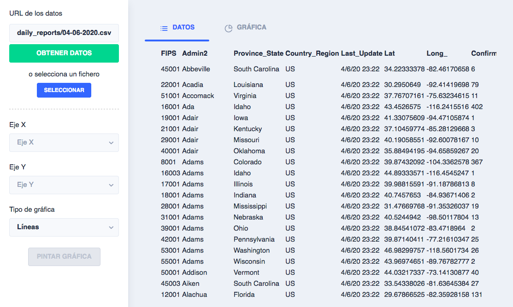

# Visualización de Datos I

## Enunciados
#### 1. Lee el documento ["Why scientists need to be better at data visualizationURL"](https://www.knowablemagazine.org/article/mind/2019/science-data-visualization) hasta la sección "Ruinous rainbows", esta última sección no incluida. Haz un resumen de no más de una página con las conclusiones que obtienes.
El ser humado es una criatura visual por naturaleza, por lo cual, procesa mejor la información que es acompañada de alguna representación visual (imágenes, gráficos...). Sin embargo, para ello, en el caso de la representación en gráficos, dicha información debe estar bien presentantada, es decir, con el tipo de correcto de gráficos (barras, líneas, puntos) acorde a la información, los colores adecuados... puesto que si no lo estuviera se podría transmitir información confusa o incorrecta a la que deseamos transmitir.

#### 2. En la sesión de teoría hemos analizado el portal Gapminder que proporciona información visual sobre muchas tematicas. Realiza una búsqueda en internet intentando localizar portales o frameworks de características similares, en los que grandes volúmenes de datos se muestren de manera gráfica/visual y con una perspectiva genérica.
Conocidas:

* Framework [TerriaJS](https://terria.io/). https://www.nationalmap.gov.au/
* [SiAR](https://siar.arte-consultores.com/#/visualizador)

Encontradas por internet:

* [Statista](https://es.statista.com/)
* [Google Public Data Explorer](https://www.google.com/publicdata/directory?hl=es)
* Framework [rawgraphs](https://rawgraphs.io/)
* [worldmapper](https://worldmapper.org/)

#### 3. Desarrolla un pequeño entorno de visualización. El entorno debe separar las rutinas de representación de los datos, de las fuentes de las que se obtienen datos mediante una capa de abstracción en la que se estandaricen las interfaces mediante dataframes unificados que permitirán realizar representaciones gráficas para determinados patrones de datos. Las fuentes de datos podrían ser diversas, por tanto, asociado a cada una de ellas deberíamos disponer de un analizador/transformador que convierta el conjunto de datos desde la fuente de origen al dataframe. El patrón de diseño "Estrategia" [3, 4] puede serte útil en este nivel del desarrollo. Para una determinada fuente de datos deberías generar al menos dos representaciones, diferentes, por ejemplo, líneas y diagramas de barras. Describe en una página el diagrama de clases del  framework y la tecnología utilizada para su desarrollo. Considera al menos dos fuentes de datos para ilustrar su uso.
Se ha desarrollado un script, en python 3, que hace uso de las librerías [`Pandas`](https://pandas.pydata.org/) para el tratamiento de los datos y [`Matplotlib`](https://matplotlib.org/) para la renderización de las gráficas. Dicho script recibe una serie de argumentos, los cuales pueden ser listados ejecutando `python3 main.py --help`.

```bash
$ python3 main.py --help                                                                                             
usage: main.py [-h] --x-axis X_AXIS --y-axis Y_AXIS [--url URL] [--chart-type {line,bar,point}] [--chart-name CHART_NAME]
               [--chart-file-name CHART_FILE_NAME] [--base64]

optional arguments:
  -h, --help                         show this help message and exit
  --x-axis X_AXIS                    Chart X axis
  --y-axis Y_AXIS                    Chart Y axis
  --url URL                          Url of data
  --chart-type {line,bar,point}      Chart type
  --chart-name CHART_NAME            Chart name
  --chart-file-name CHART_FILE_NAME  Chart file name
  --base64                           Print image as base64
```

**Uso del script**

Los datos deben estar en formato `.csv`, con `,` como separador, y pueden ser indicados mediante:
* Una URL (argumento `--url`), por ejemplo https://raw.githubusercontent.com/CSSEGISandData/COVID-19/master/csse_covid_19_data/csse_covid_19_daily_reports/04-06-2020.csv.
    ```bash
    $ python3 main.py --x-axis Country_Region --y-axis Active --chart-type line --url https://raw.githubusercontent.com/CSSEGISandData/COVID-19/master/csse_covid_19_data/csse_covid_19_daily_reports/04-06-2020.csv
    ```
* Fichero local. Por ejemplo:
    ```bash
    $ python3 main.py --x-axis Province_State --y-axis Confirmed --chart-type line < test.csv
    ```
    ```bash
    $ cat test.csv | python3 main.py --x-axis Province_State --y-axis Confirmed --chart-type line 
    ```

Los argumentos `--x-axis` y `--y-axis` corresponden a las columnas de datos que se representarán en los ejes X e Y respectivamente, por lo tanto su valor será el nombre de la columna asociada. En caso de especificar un nombre de columna no existente en el CSV se obtendrá un error similar a:
```
Seleccione un valor del listado para Y axis: ['FIPS', 'Admin2', 'Province_State', 'Country_Region', 'Last_Update', 'Lat', 'Long_', 'Confirmed', 'Deaths', 'Recovered', 'Active', 'Combined_Key']
```

Mediante el argumento `--chart-type` se señala el tipo de gráfico a usar para la representación. Se debe usar una de entre `line, bar, point`. Su valor por defecto es `line`.

La ejecución del script dará como resultado la imagen de la gráfica en un fichero con nombre `Chart name.png`, por defecto, en caso de no haberse especificado otro mediante el argumento `--chart-file-name`. En caso de usar el argumento `--base64` el script imprimirá por pantalla la imagen en `base64`, sin guardarla.

**Clases**
Por un lado se ha implementado la clase [`DataSource`](script/data_source.py) y sus variantes, hijas de ésta, `UrlDataSource` y `StdinDataSource`. `UrlDataSource` se usa para obtener los datos a partir de la url y `StdinDataSource`, a partir de los datos que se pasen en la ejecución del script, mediante el fichero local, por ejemplo.

Por otro lado, para pintar la gráfica, se ha implementado la clase [`Chart`](script/chart.py) y sus clases hijas, `LineChart`, `BarChart` y `PointChart`, las cuales se usan para los gráficos de tipo linea, barras y puntos respectivamente.


#### 4. Haciendo uso del componente "servidor" desarrollado en la asignatura Computación en la Nube, convierte en un servicio el framework desarrollado. Para poder acceder a este servicio, deberías desarrollar asimismo un cliente específico que permita al usuario seleccionar el origen de los datos que van a ser representados y que en el servidor se realicen las representaciones que serán mostradas por el cliente. Describe en una página la arquitectura software de la aplicación y las tecnologías desarrolladas.

|  | 
|:--:| 
| **Puede acceder a la aplicación en [http://edu.ajmonfue.me/adm-1/](http://edu.ajmonfue.me/adm-1/)** |

Se ha implementado un componente servidor, con [NestJS](https://nestjs.com/), el cual utiliza el script realizado en python. Por otro lado, la parte del cliente se ha realiza con [Angular 9](https://angular.io/), y en ésta se pueden realizar las mismas acciones que con el script en python:
* Especificar los datos mediante una url o un fichero.
* Una vez cargados los datos se puede seleccionar los parámetros necesarios para crear el gráfico (columna del eje x, columna del eje y, y tipo de gráfico). Adicionalmente, los datos cargados se muestran en una tabla.
    
    |  | 
    |:--:| 
    | *Tabla de datos* |

* Tras especificar los parámetros y darle al botón `Pintar gráfica`, se mostrará la imagen generada por el script en python.


## Construcción de imagen docker y publicación en Github Packages
Construir la parte del cliente:
```bash
$ docker build -t docker.pkg.github.com/didream/adm-visualizacion-datos-i/adm-client:1.0.2  -f client/etc/Dockerfile ./client
$ docker push docker.pkg.github.com/didream/adm-visualizacion-datos-i/adm-client:1.0.2
```

Construir la parte del servidor, con el script de python:
```bash
$ docker build -t docker.pkg.github.com/didream/adm-visualizacion-datos-i/adm-server:1.0.1  -f server/etc/Dockerfile .
$ docker push docker.pkg.github.com/didream/adm-visualizacion-datos-i/adm-server:1.0.1
```

**Enlaces de interés**
* Github Packages para imágenes docker (https://docs.github.com/es/packages/using-github-packages-with-your-projects-ecosystem/configuring-docker-for-use-with-github-packages)